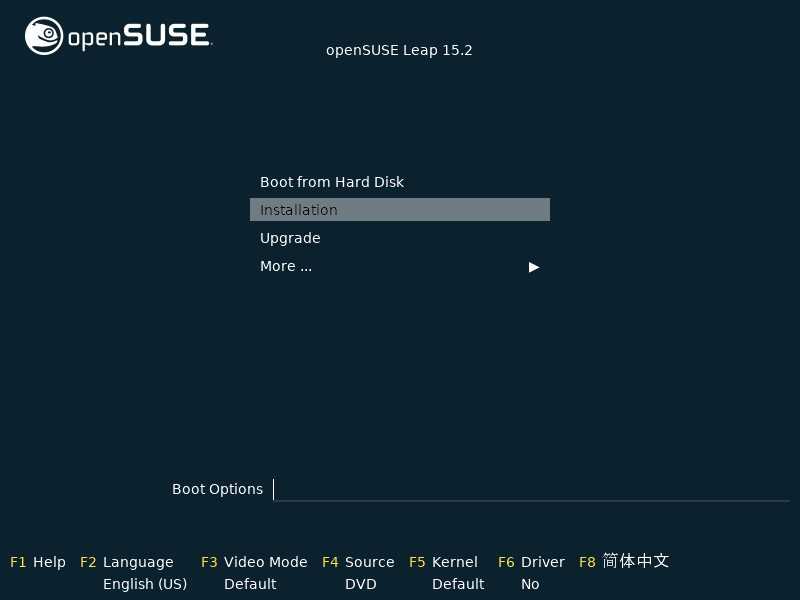
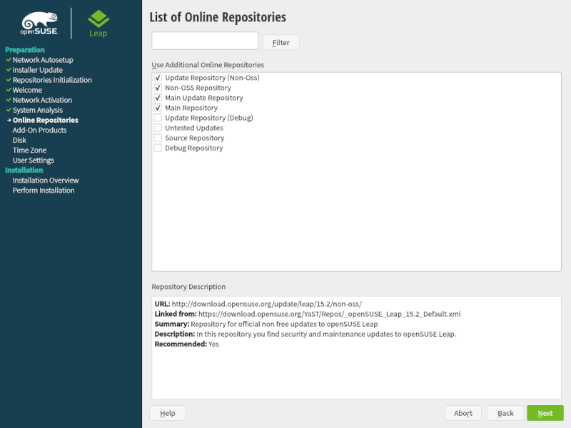

# Step by step guide
## Before you continue

* Make sure that you backed up all your data from the disk where you're planning to install openSUSE to.
* If installing it on a separate drive and if you can, go ahead and disconnect the drives that you will not use. You can always foreign operating systems to Grub from a final installation, but selecting the wrong drive to install openSUSE to will overwrite the disk.
* In case you're using a Network image (Netiso) make sure that you have a strong internet connection. A wired connection is always better than a wifi signal.
* If installing it on a laptop it is a good practice to plug in the AC charger.

If you read the above listed safety measures and hopefully followed them, you're ready to boot your erlier prepared USB drive and turn on your computer. Boot from the USB drive and select installation from the boot menu.

If you want to see details while the installer is booting you can press `ESC` on the keyboard.

## Language, Keyboard and License Agreement

*Welcome to the YaST installer!*
 
This is the first step to make to end up with a fully functional openSUSE installation. At this page you can change the language under `Language` (Alt+L), change the keyboard layout under `Keyboard Layout` (Alt+K) and you have a chance to test your selected keyboard layout in the field under `Keyboard Test` (Alt+y).
If you done all the basic configurations do read through the `License Agreement` as it is informing you on roles, responsibilities and potential limitations.

??? info   
    On the left you will see a list of items where you can follow the steps you will take next or took already. You can always press `Back` in case you want to change something you configured earlier.

Clicking next will take you to the next step.

## List of Online Repositories

If you have an active Internet conenction over an ethernet cable connected to your computer, right after you pass the *"Language, Keyboard and License Agreement"* section you will be prompted with a question if you want to *"activate online repositories now?"*.It is recommended to select *Yes* which will provide with a list repositories, pre-selecting the main ones in advance. These repositories are the following:

* Update Repository (Non-Oss): Non-free - as in Free Open-Source Software (FOSS) - update repository. Provides security and maintenance updates for the distribution. Selected.
* Non-OSS Repository: Non-free repository. Provides packages like Steam. Selected.
* Main Update Repository: Main free - as in FOSS - update repository. Provides security and maintenance updates for the distribution. Selected. 
* Main Repository: Main free repository provides FOSS only. Selected.
* Update Repository (Debug): A repository for those who want to debug application updates for openSUSE, for experts only. 
* Untested Updates: Security and maintenance updates that requires testing. Add this repository if you want to participate in testing.
* Source Repository: Provides all source packages in the distribution, for experts only.
* Debug Repository: A repository for those who want to debug applications for openSUSE, for experts only.

NOTE: I need to further clarify this bit!!! Do keep in mind that if you're on a metered network and you choose to add the online repos, the installer will download packages with newer versions. 

Clicking next will add and refresh the selected repositories - if any - and takes you to the next step.

