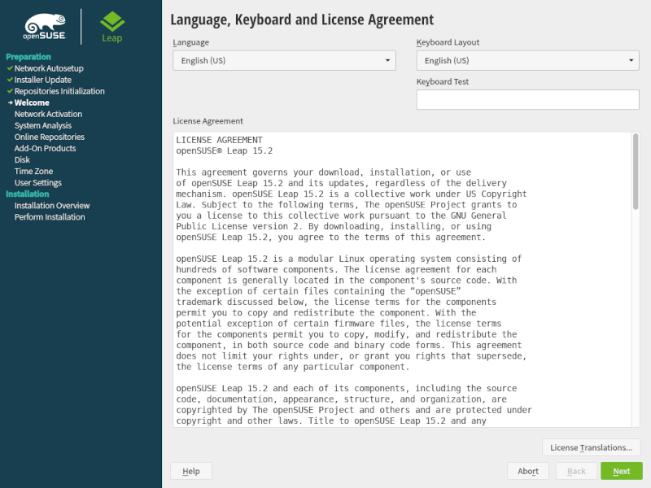
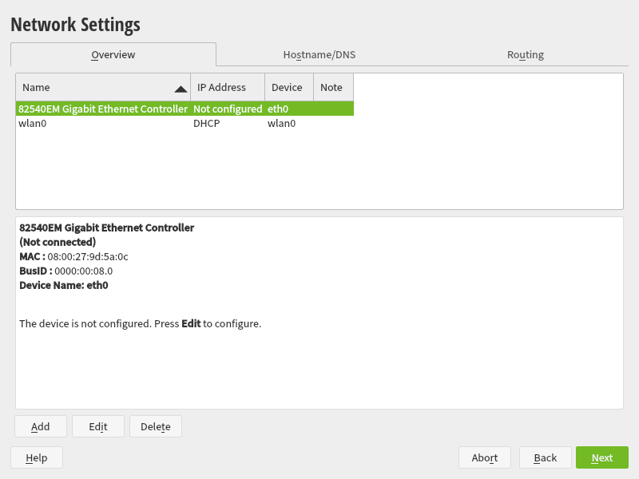
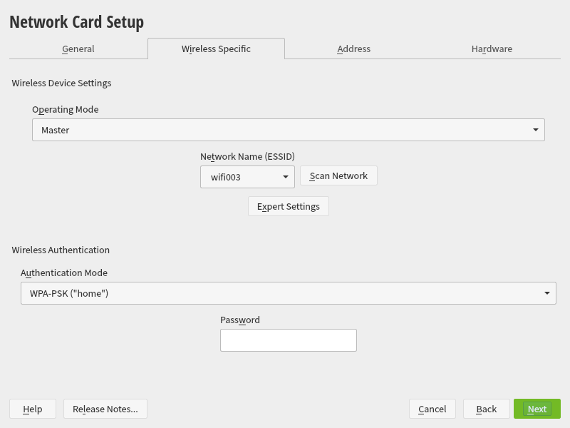
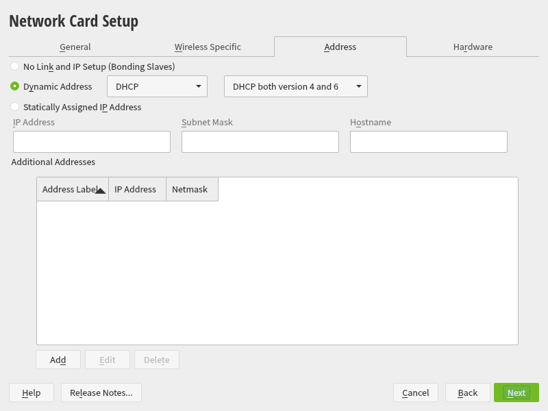
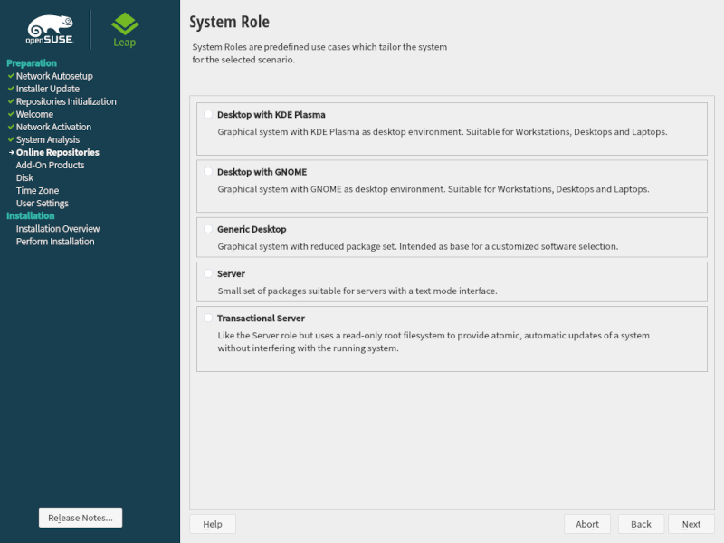

# Step by step guide
## Before you continue

* Make sure that you backed up all your data from the disk where you're planning to install openSUSE to.
* If installing it on a separate drive and if you can, go ahead and disconnect the drives that you will not use. You can always foreign operating systems to Grub from a final installation, but selecting the wrong drive to install openSUSE to will overwrite the disk.
* In case you're using a Network image (Netiso) make sure that you have a strong internet connection. A wired connection is always better than a wifi signal.
* If installing it on a laptop it is a good practice to plug in the AC charger.

If you read the above listed safety measures and hopefully followed them, you're ready to boot your erlier prepared USB drive and turn on your computer. Boot from the USB drive and select installation from the boot menu.

If you want to see details while the installer is booting you can press `ESC` on the keyboard.

## Language, Keyboard and License Agreement

*Welcome to the YaST installer!*

This is the first step to make to end up with a fully functional openSUSE installation. At this page you can change the language under `Language` (Alt+L), change the keyboard layout under `Keyboard Layout` (Alt+K) and you have a chance to test your selected keyboard layout in the field under `Keyboard Test` (Alt+y).
If you done all the basic configurations do read through the `License Agreement` as it is informing you on roles, responsibilities and potential limitations.

??? info   
    On the left you will see a list of items where you can follow the steps you will take next or took already. You can always press `Back` in case you want to change something you configured earlier.

Clicking `Next` will take you to the next step.

## Network Settings

If you have an active wired internet connection which can automatically configure by the system you can skip this part. However, if you're not planning to use online repositories during the installation process and rely on the packages provided by the DVD installer you can skip this part.
When you don't have a network connection - because you have don't have an ethernet port on your machine or you're using wireless connections only - you will be prompted to configure your network settings. By default the YaST system installer is using a network controller software called Wicked. Keep in mind that if you will choose to use Network Manager (NM) instead of Wicked, your network configuration will not be transferred from Wicked to Network Manager.

You will see a list of available network adapters in a list from which you can select the one that you wish to configure and press `Edit`. In case of configuring a wireless adapter you will see the `Wireless Specific` tab open. Here you can `Scan Network`, select the name of you wireless network (SSID), select the authentication mode - which is in most cases will be WPA-PSK "home" - and input your password. 
On the `Addresses` tab you will be able to configure the ip address of your adapter. You can select `Dynamic Address` in which case you will receive an address from your router/other dhcp server on your network or `Statically Assigned IP Address` in which case you need to type an ip address, a subnet mask and a hostname. Click `Next` when finished.    
   

   

**If** you configured a statically assigned ip address switch to the `Routing` tab, press `Add` and add your default gateway address and select the network adapter to which you want this route to be assigned to.    
Press `OK` then `Next` to apply your changes and continue the installer.

## List of Online Repositories

If you have an active Internet conenction over an ethernet cable connected to your computer, right after you pass the *"Language, Keyboard and License Agreement"* section you will be prompted with a question if you want to *"activate online repositories now?"*.It is recommended to select *Yes* which will provide with a list repositories, pre-selecting the main ones in advance. These repositories are the following:

* Update Repository (Non-Oss): Non-free - as in Free Open-Source Software (FOSS) - update repository. Provides security and maintenance updates for the distribution. Selected.
* Non-OSS Repository: Non-free repository. Provides packages like Steam. Selected.
* Main Update Repository: Main free - as in FOSS - update repository. Provides security and maintenance updates for the distribution. Selected. 
* Main Repository: Main free repository provides FOSS only. Selected.
* Update Repository (Debug): A repository for those who want to debug application updates for openSUSE, for experts only. 
* Untested Updates: Security and maintenance updates that requires testing. Add this repository if you want to participate in testing.
* Source Repository: Provides all source packages in the distribution, for experts only.
* Debug Repository: A repository for those who want to debug applications for openSUSE, for experts only.

NOTE: I need to further clarify this bit!!! Do keep in mind that if you're on a metered network and you choose to add the online repos, the installer will download packages with newer versions. 

Clicking `Next` will add and refresh the selected repositories - if any - and takes you to the next step.

## System Role

At this section of the preparation you can select from a list of predefined use cases which will tailor the system for the selected scenario. It is recommended to take a look at the [Choosing the right image](pick_an_image.md) page prior to continuing as it provides a brief explanation of desktop environments. Do note if you're using a DVD installer without an active internet connection, some of the listed desktop envirnments will not be available.

* Desktop with KDE Plasma: Will install the Plasma desktop with KDE applications.
* Desktop with GNOME: Will install the GNOME desktop with GNOME applications.
* Generic Desktop: Will install IceWM - a minimal desktop environment - with minimal amount of packages.
* Server: Will perform a server installation without providing any graphical environment.
* Transactional Server: Will perform a server installation with a read-only root filesystem in an immutable server style. This will provide atomic, automatic updates and packages can be installed with `transactional-update` only.

Select whichever suits your needs the best and press `Next` to conitnue.

## Suggested Partitioning

